# salonapp

Smart salon is an online booking salon mobile application that allows users to book salon appointments per their needs. 
People can make an appointment with the salon any time that suits them for whatever service they want.
 Hence, it will be a useful app for both salon owners and customers with online salon booking.
  While customers can book appointments online, the salon owner will easily manage and schedule appointments.
   Online booking will also benefit shop owners. Owners don’t need to hire someone for this tedious task.

## Technologies used
- Flutter
- Github
- Visual studio code
- firebase
- Azure devops

## How to run the app

1. Clone repo - ```https://github.com/Sarah358/smartsalonapp.git```
2. run  ```flutter pub get```
3. Navigate to main.dart and run the project or use the command ``` flutter run ```

## App screenshots
 &nbsp;&nbsp;&nbsp;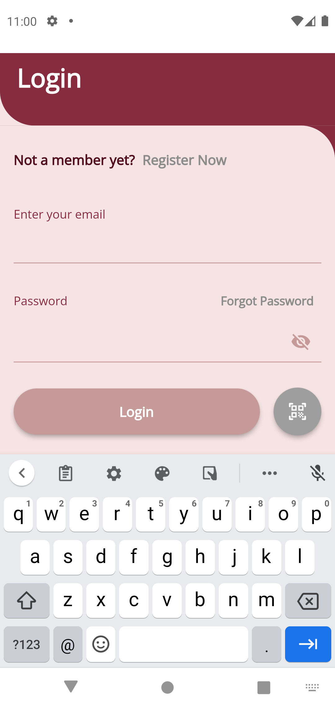 &nbsp;&nbsp; &nbsp;  &nbsp; &nbsp; &nbsp;
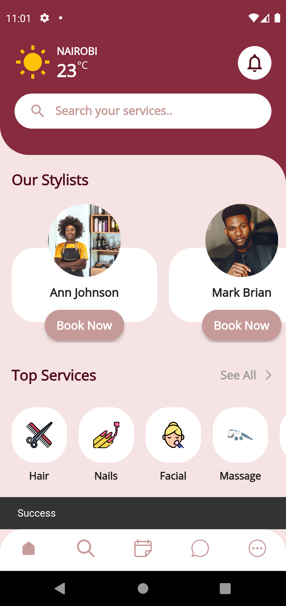&nbsp;&nbsp; &nbsp;  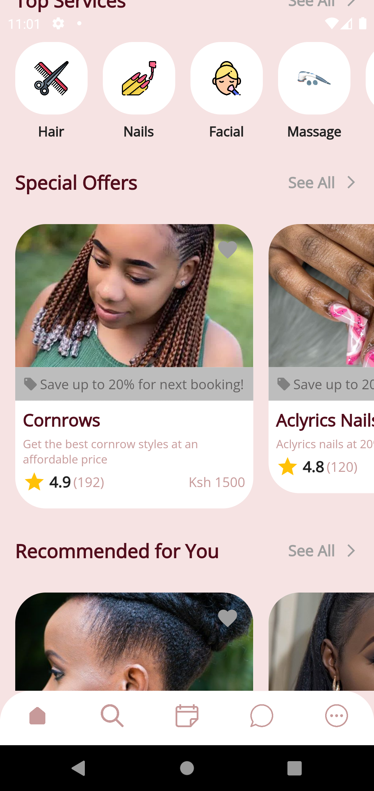  

###

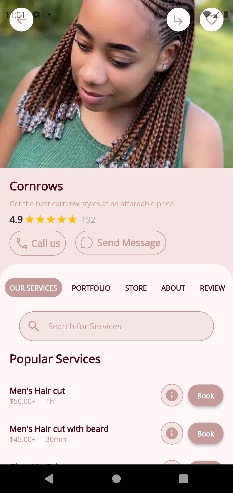&nbsp;&nbsp;&nbsp;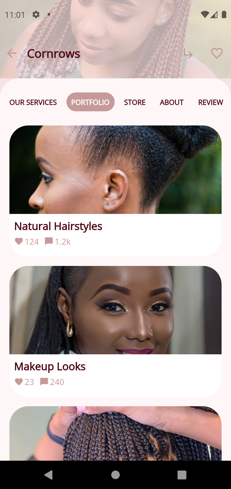  &nbsp; &nbsp; &nbsp; 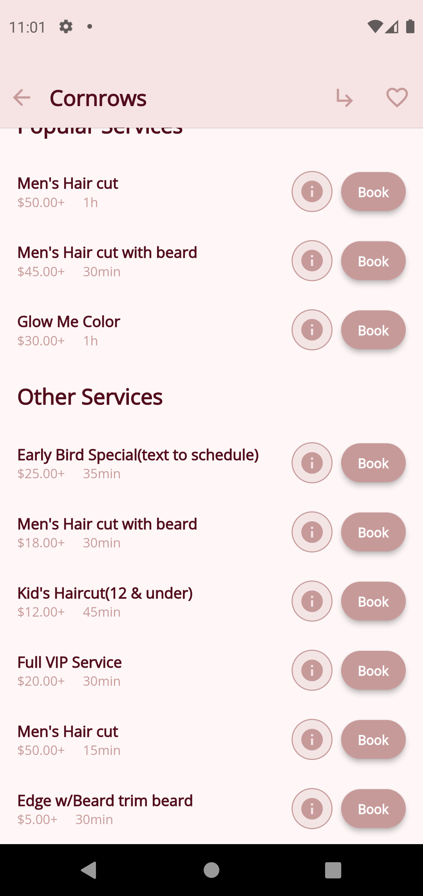 &nbsp; &nbsp; &nbsp; 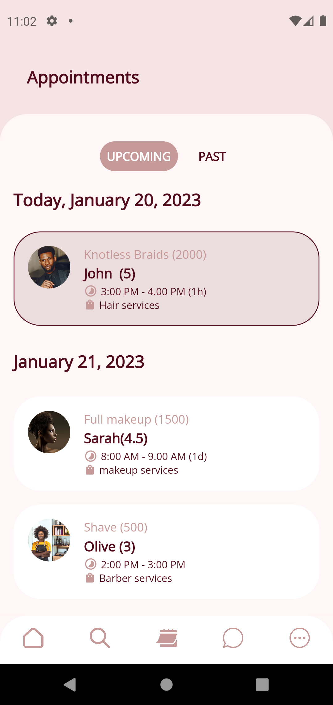&nbsp; &nbsp; &nbsp;  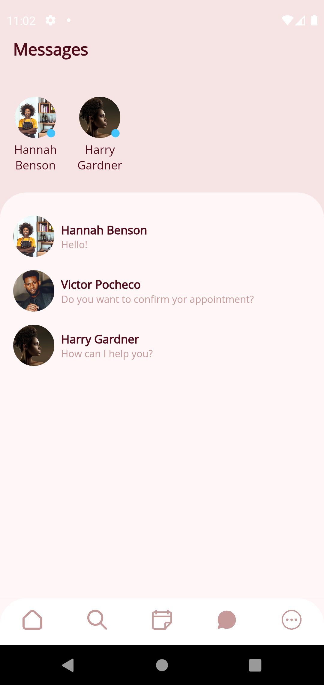    

###

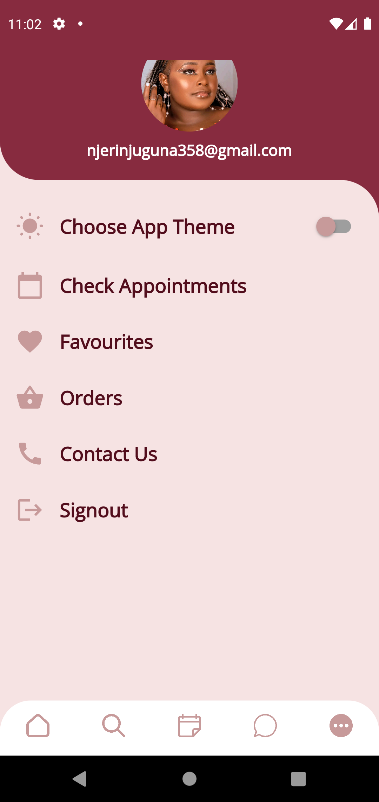&nbsp; &nbsp; &nbsp; 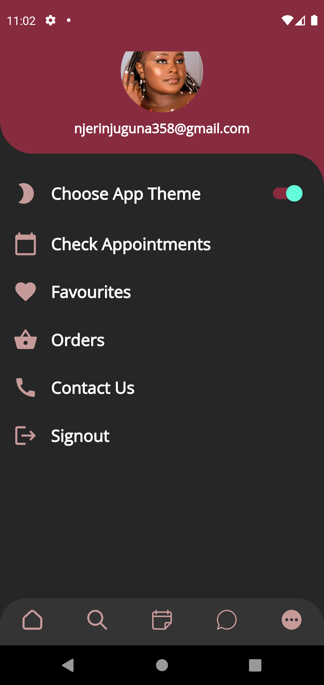  &nbsp; &nbsp; &nbsp; 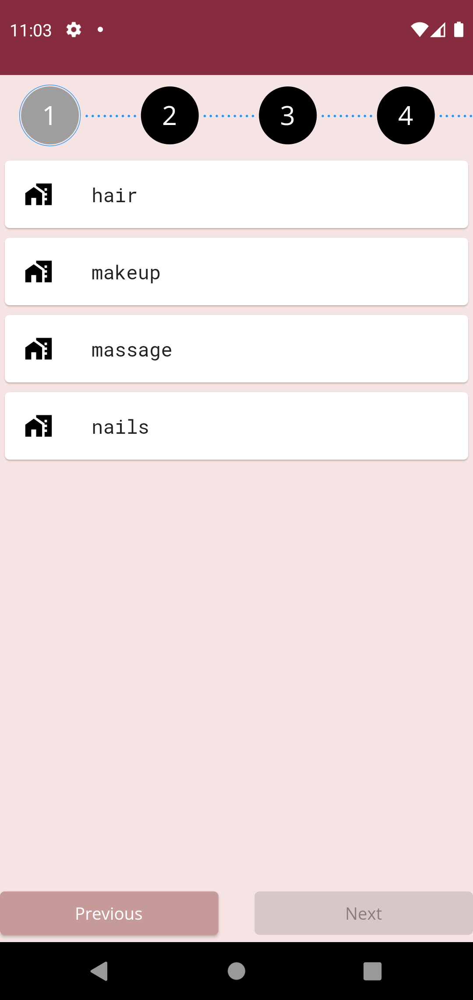&nbsp; &nbsp; &nbsp;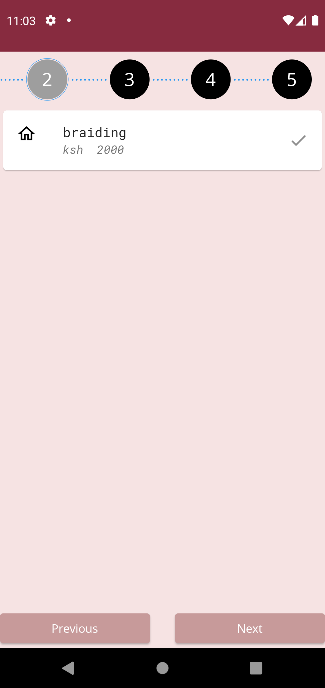 &nbsp; &nbsp; &nbsp;   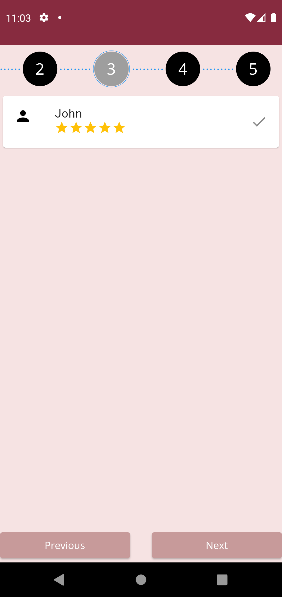 

###

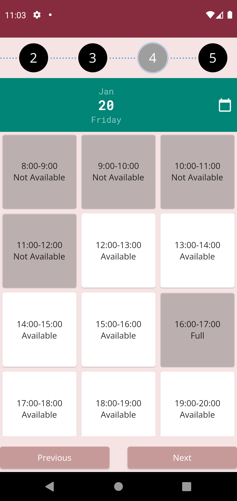&nbsp; &nbsp; &nbsp; 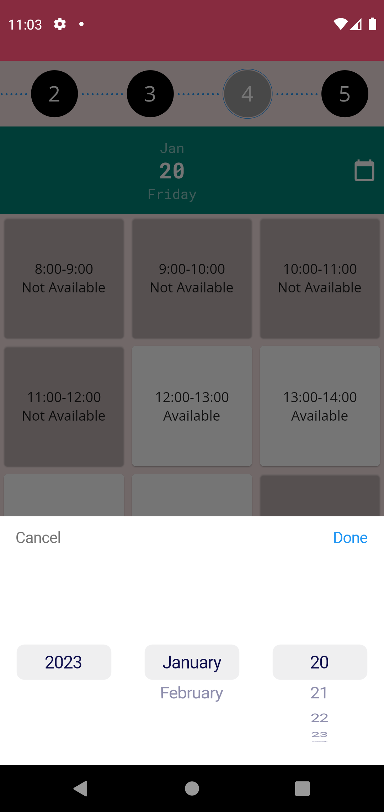&nbsp; &nbsp; &nbsp; 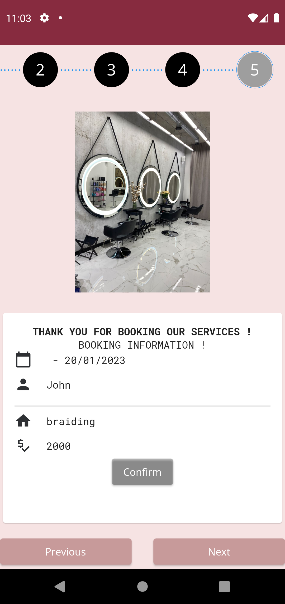


  
