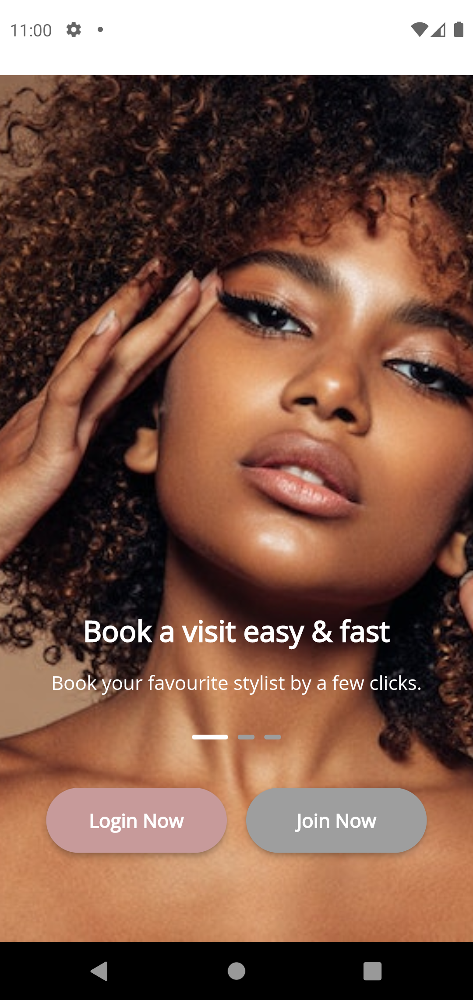

# salonapp

Smart salon is an online appointment booking salon mobile application for executive salon and barber shop which runs on android devices that allows their customers to book appointments per their needs. 
People can make an appointment with the salon any time that suits them for whatever service and stylist they want provided the time slot is available.
 Hence, it will be a useful app for both executive salon staff and their customers since customers won't have to queue to get services.


## Technologies used
- Flutter
- Github
- Visual studio code
- firebase
- Azure devops

## How to run the app

1. Clone repo - ```https://github.com/Sarah358/smartsalonapp.git```
2. run  ```flutter pub get```
3. Navigate to main.dart and run the project or use the command ``` flutter run ```

## App screenshots
 &nbsp;&nbsp;&nbsp; &nbsp;&nbsp; &nbsp;  &nbsp; &nbsp; &nbsp;
&nbsp;&nbsp; &nbsp;    

###

&nbsp;&nbsp;&nbsp;  &nbsp; &nbsp; &nbsp;  &nbsp; &nbsp; &nbsp; &nbsp; &nbsp; &nbsp;      

###

&nbsp; &nbsp; &nbsp;   &nbsp; &nbsp; &nbsp; &nbsp; &nbsp; &nbsp; &nbsp; &nbsp; &nbsp;    

###

&nbsp; &nbsp; &nbsp; &nbsp; &nbsp; &nbsp; 


  
